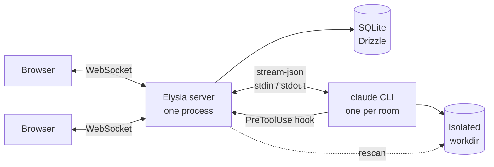

<div align="center">


# multiclaude

**One Claude Code agent. Several people. One conversation.**

Real-time collaborative chat on top of the Claude Code CLI — streamed answers, visible
actions, live files, and a human decision before anything dangerous runs.

[](LICENSE)
[](https://bun.sh)
[](https://www.typescriptlang.org)
[](https://www.benode.fr)

**English** ·
[Français](README_fr.md) ·
[Español](README_es.md) ·
[Deutsch](README_de.md) ·
[简体中文](README_zh.md)


</div>

---

## Why

Claude Code is superb, and stubbornly single-player. Pair with someone on a real task and
you end up reading a terminal over their shoulder, asking them to run things for you, and
losing every decision the moment the window closes.

multiclaude puts that agent in a room. Everyone types into the same conversation, sees the
same actions, opens the same files, and can stop or redirect the agent. The work is
persistent, the context is shared, and no one has to be the person holding the keyboard.

It drives the **real `claude` binary** on your machine, with your own subscription. No API
key, no proxy, no reimplementation of the agent loop.

---

## Features

### Working together

|  |  |
| --- | --- |
| **Live presence** | See who is connected, where they are in the thread, and which file they have open. |
| **Follow someone** | Click a participant's avatar and your view mirrors theirs — same file, same scroll position. |
| **Shared selections** | Text someone selects is highlighted in their colour, in the thread and inside documents, the way a shared document does it. |
| **Typing, with a peek** | An indicator shows who is writing; hover it to read their draft before they send it. |
| **Shared drafts** | Your unsent message follows you across devices and survives a restart. |
| **Message queue** | The agent takes one turn at a time. Concurrent messages queue up, pinned above the input — editable and cancellable until they go out. |
| **Interrupt** | Stop a running turn without killing the process or losing the session. |
| **Fork a conversation** | Same files, same inherited context, two threads that diverge. Explore without spoiling someone else's work. |
| **Archive, don't delete** | Removing a conversation archives it: history, files and context stay, and one click brings it back. Erasing for good is a separate, deliberate action. |

### The agent

|  |  |
| --- | --- |
| **Your subscription** | One long-lived `claude` process per conversation, driven over `stream-json`. No API key. |
| **Isolated workdir** | Each conversation gets its own directory. The agent never sees the others. |
| **Sessions that survive** | The process dies, the session does not: the next turn resumes it. |
| **Model switching** | Change model mid-conversation; everyone sees the switch. |
| **Context gauge** | Live token usage against the window, and a note in the thread when compaction happens. |
| **Sign in from the UI** | The OAuth login runs headless: open the link, paste the code back. No terminal. |

### Keeping control

|  |  |
| --- | --- |
| **Per-command policy** | `grep`, `python`, `curl`, `npm`, `git commit` run unattended. `sudo`, `pg_dump`, `git push`, `docker`, deletes outside the workdir and reaches for secrets stop and ask. |
| **Tested** | The policy carries its own test suite. It does not change without a net. |
| **Anyone can decide** | The request appears as a card in the thread, with the reason. Any participant can allow or deny. |
| **Never missed** | A chime, a flashing tab title, and a system notification when the tab is closed. |
| **Tunable** | `ALWAYS_ASK_TOOLS=Bash` makes every command ask; `ASK_PATTERNS` adds your own red flags. |

### Files and repositories

|  |  |
| --- | --- |
| **Live workdir** | Files the agent writes appear in the thread and in a side panel, as a tree or a chronological list. |
| **Rendered, not downloaded** | Markdown, code with syntax highlighting, and HTML previews — in a sandboxed frame that cannot reach the app. |
| **Follows the work** | A document edited while you read it refreshes in place, without losing your scroll. |
| **Drop anything** | Paste or drag files anywhere in the window; they land in the conversation's working directory. |
| **Start from a repo** | Clone at creation, branch included. Private repositories through an access token — used once, then forgotten — or an SSH key held by the server. |
| **Export** | Any conversation to markdown, in one click. |

### Running it for a team

|  |  |
| --- | --- |
| **Local accounts** | Email and password, sessions in SQLite, no external service. The first account is the admin. |
| **Admin panel** | Create members, hand out temporary passwords, change roles, and read the effective server configuration. |
| **Forced password change** | Accounts created by an admin cannot go anywhere until they replace the temporary password. |
| **Account CLI** | The same operations from a shell, for when nobody can sign in any more. |
| **Search** | Across every conversation, from the sidebar. |
| **Themes** | Light, dark, or follow the system. |
| **Mobile** | Real responsive layout, installable as an app, usable on a phone. |
| **One port** | The server serves the interface too: no CORS, same-origin WebSocket, one process to supervise. |

---

## Quick start

```bash
git clone https://github.com/benode-SAS/multiclaude.git
cd multiclaude
cp .env.example .env
bun install
bun run db:migrate
bun run dev
```

The interface listens on `http://localhost:3000`, the API on `8000`.

**Requirements:** [Bun](https://bun.sh) 1.3+, the [Claude Code](https://claude.com/claude-code)
CLI on your `PATH`, and `git`.

Two things happen on first launch: the app asks you to create the **admin account** — that
is simply the first account created — and the key button in the sidebar connects your
Claude subscription through a link you open and a code you paste back.

---

## Deploy

<details>
<summary><strong>Docker</strong> — the shortest path</summary>

```bash
docker build -t multiclaude .
docker run -p 8000:8000 -v multiclaude-data:/data \
  -e PUBLIC_URL=https://multiclaude.example.com \
  -e ADMIN_EMAIL=admin@example.com -e ADMIN_PASSWORD='a-solid-password' \
  multiclaude
```

All the state — SQLite database, working directories, Claude credentials — lives in
`/data`. That is the only volume worth backing up.

On Railway, Fly or similar: point the service at this `Dockerfile`, attach a persistent
volume on `/data`, and set `PUBLIC_URL`. Without a volume, every redeploy starts over.

</details>

<details>
<summary><strong>On a server</strong>, with or without PM2</summary>

```bash
cp .env.example .env    # set at least PORT, DATA_DIR and PUBLIC_URL
bun run deploy          # install + build + migrations
bun run start
```

`ecosystem.config.cjs` ships a PM2 configuration: single process (room state lives in
memory, so never cluster mode), a restart guard, and a kill timeout long enough for the
child `claude` processes to wind down.

```bash
pm2 start ecosystem.config.cjs && pm2 save
```

</details>

---

## Managing accounts

The first account created is an admin. From there, ⚙ → **Users** adds someone: the app
generates a temporary password, shown once, which that person must replace at their first
sign-in. The key button next to an account regenerates it.

This works whatever the signup setting says — `SIGNUP_ENABLED` only governs the public
form.

The same operations exist on the command line, which is what you need when nobody can sign
in any more:

```bash
bun run cli users list
bun run cli users add alice@example.com "Alice Martin" --admin
bun run cli users password alice@example.com    # regenerate the password
bun run cli users role alice@example.com member
bun run cli users remove alice@example.com
```

The CLI enforces the same guards as the interface: it refuses to remove the last admin,
and it runs pending migrations if the database is behind.

---

## Configuration

Everything is set in a `.env` at the root; `.env.example` documents every variable. The
ones that shape a deployment:

| Variable | What it does |
| --- | --- |
| `PORT` | Port for the API and the interface |
| `PUBLIC_URL` | Public URL — session cookies depend on it |
| `DATA_DIR` | Database, working directories, credentials. The one directory to back up |
| `SIGNUP_ENABLED` | The public signup form. An admin can create accounts either way |
| `ADMIN_EMAIL` / `ADMIN_PASSWORD` | Creates the admin at boot, unattended |
| `CLAUDE_CONFIG_DIR` | Where the CLI keeps its credentials. Pointing it inside `DATA_DIR` makes a deployment self-contained |
| `ALWAYS_ASK_TOOLS` | Tools that always ask for confirmation. `Bash` locks everything down |
| `ASK_PATTERNS` | Extra patterns that force a confirmation, e.g. `prod,deploy\.sh` |
| `CLONE_DEPTH` | Clone depth when creating a room. `0` for the full history |
| `GIT_TOKEN` / `GIT_SSH_KEY` | Default access to private repositories, when nobody types a token |

---

## Security — read this before exposing an instance

**The agent runs code on the host machine.** That is the point of the tool, and its risk.
Three things matter:

1. **Do not run it as `root`.** Create a dedicated user. The permission policy asks before
   dangerous commands, but it works as a deny list: a destructive command nobody
   anticipated will go through. To lock it down, `ALWAYS_ASK_TOOLS=Bash` makes every
   command ask.

2. **Any account can run commands.** There is no sandbox between members: hand out
   accounts to people you trust, and close signups (`SIGNUP_ENABLED=false`) on an instance
   reachable from the internet.

3. **The HTML preview executes JavaScript**, in an opaque origin (`sandbox` without
   `allow-same-origin`): the page can reach neither the app, nor storage, nor the API. It
   can, however, make outbound requests.

Secrets stay out of the agent's reach: `AUTH_SECRET`, `ADMIN_PASSWORD` and `GIT_TOKEN` are
stripped from the environment handed to the CLI, and a clone token never lands in
`.git/config`.

Found a vulnerability? [SECURITY.md](SECURITY.md).

---

## How it works



Bun monorepo: `apps/server` (Elysia + WebSocket), `apps/web` (React + Vite),
`packages/shared` (the WebSocket contract and shared types).

**One room, one `claude` process**, kept alive between turns so the conversation keeps its
context. If it dies, it comes back with `--resume` on the same session. Forking branches
off the parent session.

**Permissions go through a `PreToolUse` hook** that calls the server and blocks until a
human clicks. That is what makes it possible to decide from the interface rather than from
a terminal.

**File changes come from rescanning the directory**, not from system events alone: the
agent writes through a temporary file then renames it, and the final name never appears in
the event.

**Room state lives in memory** — hence a single server process, never a cluster mode.

```bash
bun run dev        # server + interface in watch mode
bun run check      # lint and formatting (Biome)
bun run typecheck
bun run test
```

---

## Contributing

Issues and pull requests are welcome. Before proposing a change: `bun run check`,
`bun run typecheck` and `bun run test` must pass — that is what CI runs. See
[CONTRIBUTING.md](CONTRIBUTING.md) for the conventions.

## Origin and licence

multiclaude is built and maintained by **[benode](https://www.benode.fr)**, and released
under the **MIT** licence — see [LICENSE](LICENSE).

MIT allows everything: private or commercial use, modification, redistribution, bundling
into a closed product, resale. It sets **one condition**: keep the copyright notice and
the licence text in copies and derived works. In other words, do what you like with it,
but do not strip the authorship.
