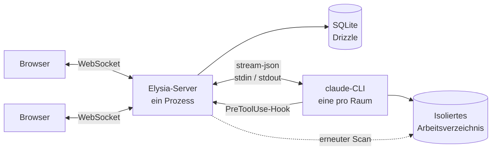

<div align="center">


# multiclaude

**Ein Claude-Code-Agent. Mehrere Menschen. Eine Unterhaltung.**

Kollaborativer Echtzeit-Chat auf der Claude-Code-CLI — gestreamte Antworten, sichtbare
Aktionen, Dateien in Echtzeit und eine menschliche Entscheidung, bevor irgendetwas
Gefährliches läuft.

[](LICENSE)
[](https://bun.sh)
[](https://www.typescriptlang.org)
[](https://www.benode.fr)

[English](README.md) ·
[Français](README_fr.md) ·
[Español](README_es.md) ·
**Deutsch** ·
[简体中文](README_zh.md)


</div>

---

## Warum

Claude Code ist hervorragend — und hartnäckig ein Einzelspieler. Arbeitet man zu zweit an
einer echten Aufgabe, liest man am Ende über die Schulter des anderen in einem Terminal
mit, lässt sich Befehle ausführen und verliert jede Entscheidung in dem Moment, in dem das
Fenster geschlossen wird.

multiclaude stellt diesen Agenten in einen Raum. Alle schreiben in dieselbe Unterhaltung,
sehen dieselben Aktionen, öffnen dieselben Dateien und können den Agenten stoppen oder
umlenken. Die Arbeit bleibt erhalten, der Kontext ist geteilt, und niemand muss derjenige
sein, der die Tastatur hält.

Es steuert die **echte `claude`-Binärdatei** auf deiner Maschine, mit deinem eigenen Abo.
Kein API-Schlüssel, kein Proxy, keine nachgebaute Agentenschleife.

---

## Funktionen

### Zusammenarbeiten

|  |  |
| --- | --- |
| **Live-Präsenz** | Wer verbunden ist, wo die Person im Verlauf steht und welche Datei sie geöffnet hat. |
| **Jemandem folgen** | Klick auf den Avatar einer Person, und deine Ansicht spiegelt ihre — gleiche Datei, gleiche Scrollposition. |
| **Geteilte Auswahl** | Markierter Text erscheint in der Farbe der jeweiligen Person, im Verlauf wie in Dokumenten, so wie es ein geteiltes Dokument tut. |
| **Tippen, mit Blick darauf** | Eine Anzeige zeigt, wer schreibt; beim Überfahren liest du den Entwurf, bevor er abgeschickt wird. |
| **Geteilte Entwürfe** | Deine nicht gesendete Nachricht folgt dir über Geräte hinweg und übersteht einen Neustart. |
| **Nachrichten-Warteschlange** | Der Agent nimmt einen Zug nach dem anderen. Gleichzeitige Nachrichten reihen sich ein, über dem Eingabefeld angeheftet — bearbeitbar und stornierbar, bis sie rausgehen. |
| **Unterbrechen** | Einen laufenden Zug stoppen, ohne den Prozess zu töten oder die Sitzung zu verlieren. |
| **Unterhaltung forken** | Gleiche Dateien, gleicher geerbter Kontext, zwei Stränge, die auseinandergehen. Ausprobieren, ohne die Arbeit der anderen zu ruinieren. |
| **Archivieren statt löschen** | Eine Unterhaltung zu entfernen archiviert sie: Verlauf, Dateien und Kontext bleiben, ein Klick holt sie zurück. Endgültiges Löschen ist eine eigene, bewusste Aktion. |

### Der Agent

|  |  |
| --- | --- |
| **Dein Abo** | Ein langlebiger `claude`-Prozess pro Unterhaltung, über `stream-json` gesteuert. Kein API-Schlüssel. |
| **Isoliertes Arbeitsverzeichnis** | Jede Unterhaltung hat ihr eigenes. Der Agent sieht die anderen nie. |
| **Sitzungen, die überleben** | Der Prozess stirbt, die Sitzung nicht: der nächste Zug nimmt sie wieder auf. |
| **Modellwechsel** | Wechsle das Modell mitten in der Unterhaltung; alle sehen den Wechsel. |
| **Kontextanzeige** | Live-Tokenverbrauch gegenüber dem Fenster, und ein Hinweis im Verlauf, wenn kompaktiert wird. |
| **Anmeldung aus der Oberfläche** | Der OAuth-Login läuft ohne Terminal: Link öffnen, Code zurück einfügen. |

### Die Kontrolle behalten

|  |  |
| --- | --- |
| **Regeln pro Befehl** | `grep`, `python`, `curl`, `npm`, `git commit` laufen unbeaufsichtigt. `sudo`, `pg_dump`, `git push`, `docker`, Löschungen außerhalb des Arbeitsverzeichnisses und Zugriffe auf Geheimnisse halten an und fragen nach. |
| **Getestet** | Die Regeln bringen ihre eigene Testsuite mit. Sie ändern sich nicht ohne Netz. |
| **Jede Person entscheidet** | Die Anfrage erscheint als Karte im Verlauf, mit Begründung. Jede beteiligte Person kann erlauben oder ablehnen. |
| **Nie übersehen** | Ein Signalton, ein blinkender Tab-Titel und eine Systembenachrichtigung, wenn der Tab geschlossen ist. |
| **Einstellbar** | `ALWAYS_ASK_TOOLS=Bash` lässt jeden Befehl nachfragen; `ASK_PATTERNS` ergänzt eigene Warnsignale. |

### Dateien und Repositorys

|  |  |
| --- | --- |
| **Arbeitsverzeichnis in Echtzeit** | Dateien, die der Agent schreibt, erscheinen im Verlauf und in einem Seitenpanel, als Baum oder als chronologische Liste. |
| **Gerendert, nicht heruntergeladen** | Markdown, Code mit Syntaxhervorhebung und HTML-Vorschauen — in einem abgeschotteten Rahmen, der die Anwendung nicht erreichen kann. |
| **Folgt der Arbeit** | Ein Dokument, das beim Lesen bearbeitet wird, aktualisiert sich an Ort und Stelle, ohne deine Position zu verlieren. |
| **Alles ablegen** | Dateien überall im Fenster einfügen oder hineinziehen; sie landen im Arbeitsverzeichnis der Unterhaltung. |
| **Von einem Repository starten** | Klonen beim Anlegen, Branch inklusive. Private Repositorys über ein Zugriffstoken — einmal benutzt, dann vergessen — oder über einen SSH-Schlüssel auf dem Server. |
| **Export** | Jede Unterhaltung als Markdown, mit einem Klick. |

### Im Team betreiben

|  |  |
| --- | --- |
| **Lokale Konten** | E-Mail und Passwort, Sitzungen in SQLite, kein externer Dienst. Das erste Konto ist das Administratorkonto. |
| **Admin-Bereich** | Mitglieder anlegen, temporäre Passwörter ausgeben, Rollen ändern und die tatsächliche Serverkonfiguration einsehen. |
| **Erzwungener Passwortwechsel** | Ein von einer Administration angelegtes Konto kommt nirgendwo hin, bevor das temporäre Passwort ersetzt ist. |
| **Konten-CLI** | Dieselben Operationen aus der Shell, für den Fall, dass sich niemand mehr anmelden kann. |
| **Suche** | Über alle Unterhaltungen hinweg, aus der Seitenleiste. |
| **Themes** | Hell, dunkel oder dem System folgen. |
| **Mobil** | Echtes responsives Layout, als App installierbar, auf dem Telefon benutzbar. |
| **Ein einziger Port** | Der Server liefert auch die Oberfläche aus: kein CORS, WebSocket auf demselben Origin, ein Prozess zu überwachen. |

---

## Schnellstart

```bash
git clone https://github.com/benode-SAS/multiclaude.git
cd multiclaude
cp .env.example .env
bun install
bun run db:migrate
bun run dev
```

Die Oberfläche lauscht auf `http://localhost:3000`, die API auf `8000`.

**Voraussetzungen:** [Bun](https://bun.sh) 1.3+, die
[Claude-Code](https://claude.com/claude-code)-CLI im `PATH` und `git`.

Beim ersten Start passieren zwei Dinge: die Anwendung bittet dich, das **Administratorkonto**
anzulegen — das ist schlicht das erste angelegte Konto — und die Schaltfläche mit dem
Schlüssel in der Seitenleiste verbindet dein Claude-Abo über einen Link, den du öffnest,
und einen Code, den du zurück einfügst.

---

## Bereitstellen

<details>
<summary><strong>Docker</strong> — der kürzeste Weg</summary>

```bash
docker build -t multiclaude .
docker run -p 8000:8000 -v multiclaude-data:/data \
  -e PUBLIC_URL=https://multiclaude.example.com \
  -e ADMIN_EMAIL=admin@example.com -e ADMIN_PASSWORD='ein-solides-passwort' \
  multiclaude
```

Der gesamte Zustand — SQLite-Datenbank, Arbeitsverzeichnisse, Claude-Anmeldedaten — liegt
in `/data`. Das ist das einzige Volume, das eine Sicherung wert ist.

Auf Railway, Fly oder Vergleichbarem: den Dienst auf dieses `Dockerfile` zeigen lassen, ein
persistentes Volume auf `/data` einhängen und `PUBLIC_URL` setzen. Ohne Volume fängt jede
neue Bereitstellung bei null an.

</details>

<details>
<summary><strong>Auf einem Server</strong>, mit oder ohne PM2</summary>

```bash
cp .env.example .env    # mindestens PORT, DATA_DIR und PUBLIC_URL setzen
bun run deploy          # install + build + Migrationen
bun run start
```

`ecosystem.config.cjs` bringt eine PM2-Konfiguration mit: ein einzelner Prozess (der
Zustand der Räume liegt im Speicher, deshalb niemals Cluster-Modus), eine Sicherung gegen
Neustartschleifen und ein Kill-Timeout, das lang genug ist, damit die untergeordneten
`claude`-Prozesse sauber enden.

```bash
pm2 start ecosystem.config.cjs && pm2 save
```

</details>

---

## Konten verwalten

Das erste angelegte Konto ist Administrator. Von dort aus fügt ⚙ → **Users** jemanden
hinzu: die Anwendung erzeugt ein temporäres Passwort, das genau einmal angezeigt wird und
das die betreffende Person bei der ersten Anmeldung ersetzen muss. Die Schaltfläche mit dem
Schlüssel neben einem Konto erzeugt es neu.

Das funktioniert unabhängig von der Registrierungseinstellung — `SIGNUP_ENABLED` regelt nur
das öffentliche Formular.

Dieselben Operationen gibt es auf der Kommandozeile, und die brauchst du genau dann, wenn
sich niemand mehr anmelden kann:

```bash
bun run cli users list
bun run cli users add alice@example.com "Alice Martin" --admin
bun run cli users password alice@example.com    # Passwort neu erzeugen
bun run cli users role alice@example.com member
bun run cli users remove alice@example.com
```

Die CLI erzwingt dieselben Sicherungen wie die Oberfläche: sie weigert sich, die letzte
Administration zu entfernen, und führt ausstehende Migrationen aus, wenn die Datenbank
hinterherhinkt.

---

## Konfiguration

Alles wird in einer `.env` im Wurzelverzeichnis gesetzt; `.env.example` dokumentiert jede
Variable. Die prägenden:

| Variable | Wozu sie dient |
| --- | --- |
| `PORT` | Port für API und Oberfläche |
| `PUBLIC_URL` | Öffentliche URL — die Sitzungs-Cookies hängen daran |
| `DATA_DIR` | Datenbank, Arbeitsverzeichnisse, Anmeldedaten. Das einzige zu sichernde Verzeichnis |
| `SIGNUP_ENABLED` | Das öffentliche Registrierungsformular. Eine Administration kann so oder so Konten anlegen |
| `ADMIN_EMAIL` / `ADMIN_PASSWORD` | Legt die Administration beim Start an, ohne Zutun |
| `CLAUDE_CONFIG_DIR` | Wo die CLI ihre Anmeldedaten ablegt. Innerhalb von `DATA_DIR` wird die Bereitstellung eigenständig |
| `ALWAYS_ASK_TOOLS` | Werkzeuge, die immer nachfragen. `Bash` riegelt alles ab |
| `ASK_PATTERNS` | Zusätzliche Muster, die eine Bestätigung erzwingen, z. B. `prod,deploy\.sh` |
| `CLONE_DEPTH` | Klontiefe beim Anlegen eines Raums. `0` für die vollständige Historie |
| `GIT_TOKEN` / `GIT_SSH_KEY` | Standardzugang zu privaten Repositorys, wenn niemand ein Token eingibt |

---

## Sicherheit — vor dem Veröffentlichen einer Instanz lesen

**Der Agent führt Code auf der Host-Maschine aus.** Das ist der Sinn des Werkzeugs und sein
Risiko. Drei Dinge zählen:

1. **Nicht als `root` betreiben.** Lege einen eigenen Benutzer an. Die Berechtigungsregeln
   fragen vor gefährlichen Befehlen nach, arbeiten aber als Sperrliste: ein zerstörerischer
   Befehl, den niemand vorhergesehen hat, geht durch. Zum Abriegeln lässt
   `ALWAYS_ASK_TOOLS=Bash` jeden Befehl nachfragen.

2. **Jedes Konto kann Befehle ausführen.** Zwischen den Mitgliedern gibt es keine Sandbox:
   vergib Konten an Menschen, denen du vertraust, und schließe die Registrierung
   (`SIGNUP_ENABLED=false`) auf einer aus dem Internet erreichbaren Instanz.

3. **Die HTML-Vorschau führt JavaScript aus**, in einem undurchsichtigen Origin (`sandbox`
   ohne `allow-same-origin`): die Seite erreicht weder die Anwendung noch den Speicher noch
   die API. Ausgehende Anfragen kann sie hingegen stellen.

Geheimnisse bleiben außerhalb der Reichweite des Agenten: `AUTH_SECRET`, `ADMIN_PASSWORD`
und `GIT_TOKEN` werden aus der Umgebung entfernt, die die CLI erhält, und ein Klon-Token
landet nie in `.git/config`.

Eine Schwachstelle gefunden? [SECURITY.md](SECURITY.md).

---

## Wie es funktioniert



Bun-Monorepo: `apps/server` (Elysia + WebSocket), `apps/web` (React + Vite),
`packages/shared` (der WebSocket-Vertrag und die geteilten Typen).

**Ein Raum, ein `claude`-Prozess**, zwischen den Zügen am Leben gehalten, damit die
Unterhaltung ihren Kontext behält. Stirbt er, kommt er mit `--resume` auf derselben Sitzung
zurück. Ein Fork zweigt von der übergeordneten Sitzung ab.

**Berechtigungen laufen über einen `PreToolUse`-Hook**, der den Server aufruft und
blockiert, bis ein Mensch klickt. Genau das macht es möglich, aus der Oberfläche zu
entscheiden statt aus einem Terminal.

**Dateiänderungen kommen aus einem erneuten Scan des Verzeichnisses**, nicht allein aus
Systemereignissen: der Agent schreibt über eine temporäre Datei und benennt sie dann um —
der endgültige Name taucht im Ereignis nie auf.

**Der Zustand der Räume liegt im Speicher** — daher ein einzelner Serverprozess, niemals
Cluster-Modus.

```bash
bun run dev        # Server + Oberfläche im Watch-Modus
bun run check      # Lint und Formatierung (Biome)
bun run typecheck
bun run test
```

---

## Mitwirken

Issues und Pull Requests sind willkommen. Vor einem Änderungsvorschlag müssen
`bun run check`, `bun run typecheck` und `bun run test` durchlaufen — genau das führt die
CI aus. Die Konventionen stehen in [CONTRIBUTING.md](CONTRIBUTING.md).

Das Repository ist auf Englisch: Code, Kommentare, Commit-Nachrichten, Dokumentation und
die Texte der Oberfläche. Diese README-Übersetzungen folgen
[der englischen Fassung](README.md), die im Zweifel gilt.

## Herkunft und Lizenz

multiclaude wird von **[benode](https://www.benode.fr)** entwickelt und gepflegt und unter
der **MIT**-Lizenz veröffentlicht — siehe [LICENSE](LICENSE).

MIT erlaubt alles: private oder kommerzielle Nutzung, Änderung, Weitergabe, Einbau in ein
geschlossenes Produkt, Weiterverkauf. Sie stellt **eine einzige Bedingung**: den
Copyright-Hinweis und den Lizenztext in Kopien und abgeleiteten Werken behalten. Anders
gesagt: mach damit, was du willst, aber entferne nicht die Urheberschaft.
