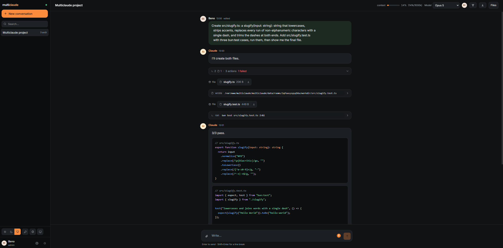
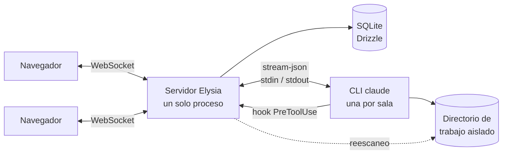

<div align="center">


# multiclaude

**Un agente Claude Code. Varias personas. Una sola conversación.**

Chat colaborativo en tiempo real sobre la CLI de Claude Code — respuestas en streaming,
acciones visibles, archivos en vivo y una decisión humana antes de que se ejecute nada
peligroso.

[](LICENSE)
[](https://bun.sh)
[](https://www.typescriptlang.org)
[](https://www.benode.fr)

[English](README.md) ·
[Français](README_fr.md) ·
**Español** ·
[Deutsch](README_de.md) ·
[简体中文](README_zh.md)



</div>

---

## Por qué

Claude Code es excelente, y obstinadamente para una sola persona. Trabaja en pareja sobre
una tarea real y acabarás leyendo una terminal por encima del hombro del otro, pidiéndole
que ejecute las cosas por ti, y perdiendo cada decisión en cuanto se cierra la ventana.

multiclaude mete a ese agente en una sala. Todos escriben en la misma conversación, ven las
mismas acciones, abren los mismos archivos y pueden detener o reorientar al agente. El
trabajo es persistente, el contexto es compartido, y nadie tiene que ser quien sujeta el
teclado.

Maneja el **binario `claude` real** en tu máquina, con tu propia suscripción. Sin clave de
API, sin proxy, sin reimplementar el bucle del agente.

---

## Funcionalidades

### Trabajar juntos

|  |  |
| --- | --- |
| **Presencia en vivo** | Quién está conectado, dónde se encuentra en el hilo y qué archivo tiene abierto. |
| **Seguir a alguien** | Haz clic en el avatar de un participante y tu vista replica la suya — mismo archivo, misma posición de desplazamiento. |
| **Selecciones compartidas** | El texto que alguien selecciona aparece resaltado con su color, tanto en el hilo como dentro de los documentos, como en un documento compartido. |
| **Escritura, con vistazo** | Un indicador muestra quién está escribiendo; pasa el ratón por encima para leer su borrador antes de que lo envíe. |
| **Borradores compartidos** | Tu mensaje sin enviar te sigue entre dispositivos y sobrevive a un reinicio. |
| **Cola de mensajes** | El agente atiende un turno cada vez. Los mensajes simultáneos se encolan, fijados sobre el campo de entrada — editables y cancelables hasta que salen. |
| **Interrumpir** | Detén un turno en curso sin matar el proceso ni perder la sesión. |
| **Bifurcar una conversación** | Mismos archivos, mismo contexto heredado, dos hilos que divergen. Explora sin estropear el trabajo de otra persona. |
| **Archivar, no borrar** | Quitar una conversación la archiva: historial, archivos y contexto permanecen, y un clic la devuelve. Borrar de verdad es una acción aparte y deliberada. |

### El agente

|  |  |
| --- | --- |
| **Tu suscripción** | Un proceso `claude` duradero por conversación, manejado por `stream-json`. Sin clave de API. |
| **Directorio de trabajo aislado** | Cada conversación tiene el suyo. El agente nunca ve los demás. |
| **Sesiones que sobreviven** | El proceso muere, la sesión no: el siguiente turno la reanuda. |
| **Cambio de modelo** | Cambia de modelo a mitad de conversación; todos ven el cambio. |
| **Medidor de contexto** | Uso de tokens en vivo frente a la ventana, y una nota en el hilo cuando ocurre una compactación. |
| **Iniciar sesión desde la interfaz** | El inicio de sesión OAuth funciona sin terminal: abre el enlace y pega el código de vuelta. |

### Mantener el control

|  |  |
| --- | --- |
| **Política por comando** | `grep`, `python`, `curl`, `npm`, `git commit` se ejecutan sin preguntar. `sudo`, `pg_dump`, `git push`, `docker`, los borrados fuera del directorio de trabajo y los accesos a secretos se detienen y preguntan. |
| **Con pruebas** | La política lleva su propia suite de pruebas. No cambia sin red. |
| **Cualquiera decide** | La solicitud aparece como una tarjeta en el hilo, con su motivo. Cualquier participante puede permitir o denegar. |
| **Nunca se pasa por alto** | Un sonido, un título de pestaña parpadeante y una notificación del sistema cuando la pestaña está cerrada. |
| **Ajustable** | `ALWAYS_ASK_TOOLS=Bash` hace que todo comando pregunte; `ASK_PATTERNS` añade tus propias señales de alarma. |

### Archivos y repositorios

|  |  |
| --- | --- |
| **Directorio de trabajo en vivo** | Los archivos que escribe el agente aparecen en el hilo y en un panel lateral, como árbol o como lista cronológica. |
| **Renderizados, no descargados** | Markdown, código con resaltado de sintaxis y vistas previas HTML — en un marco aislado que no puede alcanzar la aplicación. |
| **Sigue el trabajo** | Un documento editado mientras lo lees se actualiza en su sitio, sin perder tu posición. |
| **Suelta lo que quieras** | Pega o arrastra archivos en cualquier parte de la ventana; aterrizan en el directorio de trabajo de la conversación. |
| **Partir de un repositorio** | Clonado al crear, rama incluida. Repositorios privados mediante un token de acceso — usado una vez y olvidado — o una clave SSH que guarda el servidor. |
| **Exportar** | Cualquier conversación a markdown, con un clic. |

### Usarlo en equipo

|  |  |
| --- | --- |
| **Cuentas locales** | Correo y contraseña, sesiones en SQLite, sin servicio externo. La primera cuenta es la de administrador. |
| **Panel de administración** | Crea miembros, reparte contraseñas temporales, cambia roles y consulta la configuración efectiva del servidor. |
| **Cambio de contraseña obligatorio** | Una cuenta creada por un administrador no llega a ninguna parte hasta que reemplaza la contraseña temporal. |
| **CLI de cuentas** | Las mismas operaciones desde una terminal, para cuando ya nadie puede iniciar sesión. |
| **Búsqueda** | En todas las conversaciones, desde la barra lateral. |
| **Temas** | Claro, oscuro o seguir al sistema. |
| **Móvil** | Diseño realmente adaptable, instalable como aplicación, usable desde el teléfono. |
| **Un solo puerto** | El servidor también sirve la interfaz: sin CORS, WebSocket del mismo origen, un único proceso que supervisar. |

---

## Inicio rápido

```bash
git clone https://github.com/benode-SAS/multiclaude.git
cd multiclaude
cp .env.example .env
bun install
bun run db:migrate
bun run dev
```

La interfaz escucha en `http://localhost:3000`, la API en `8000`.

**Requisitos:** [Bun](https://bun.sh) 1.3+, la CLI de [Claude Code](https://claude.com/claude-code)
en tu `PATH`, y `git`.

Dos cosas ocurren en el primer arranque: la aplicación te pide crear la **cuenta de
administrador** — que es simplemente la primera cuenta creada — y el botón de la llave en
la barra lateral conecta tu suscripción de Claude mediante un enlace que abres y un código
que pegas de vuelta.

---

## Desplegar

<details>
<summary><strong>Docker</strong> — el camino más corto</summary>

```bash
docker build -t multiclaude .
docker run -p 8000:8000 -v multiclaude-data:/data \
  -e PUBLIC_URL=https://multiclaude.example.com \
  -e ADMIN_EMAIL=admin@example.com -e ADMIN_PASSWORD='una-contrasena-solida' \
  multiclaude
```

Todo el estado — base SQLite, directorios de trabajo, credenciales de Claude — vive en
`/data`. Ese es el único volumen que merece copia de seguridad.

En Railway, Fly o similar: apunta el servicio a este `Dockerfile`, monta un volumen
persistente en `/data` y define `PUBLIC_URL`. Sin volumen, cada redespliegue empieza de
cero.

</details>

<details>
<summary><strong>En un servidor</strong>, con o sin PM2</summary>

```bash
cp .env.example .env    # define al menos PORT, DATA_DIR y PUBLIC_URL
bun run deploy          # install + build + migraciones
bun run start
```

`ecosystem.config.cjs` incluye una configuración de PM2: un solo proceso (el estado de las
salas vive en memoria, así que nunca modo cluster), una protección contra bucles de
reinicio y un tiempo de cierre suficiente para que los procesos `claude` hijos terminen.

```bash
pm2 start ecosystem.config.cjs && pm2 save
```

</details>

---

## Gestionar las cuentas

La primera cuenta creada es de administrador. A partir de ahí, ⚙ → **Users** añade a
alguien: la aplicación genera una contraseña temporal, mostrada una sola vez, que esa
persona debe reemplazar en su primer inicio de sesión. El botón de la llave junto a una
cuenta la regenera.

Esto funciona diga lo que diga el ajuste de registro — `SIGNUP_ENABLED` solo gobierna el
formulario público.

Las mismas operaciones existen en la línea de comandos, que es lo que necesitas cuando ya
nadie puede iniciar sesión:

```bash
bun run cli users list
bun run cli users add alice@example.com "Alice Martin" --admin
bun run cli users password alice@example.com    # regenera la contraseña
bun run cli users role alice@example.com member
bun run cli users remove alice@example.com
```

La CLI aplica las mismas salvaguardas que la interfaz: se niega a eliminar al último
administrador y ejecuta las migraciones pendientes si la base va por detrás.

---

## Configuración

Todo se ajusta en un `.env` en la raíz; `.env.example` documenta cada variable. Las que
determinan un despliegue:

| Variable | Para qué sirve |
| --- | --- |
| `PORT` | Puerto de la API y de la interfaz |
| `PUBLIC_URL` | URL pública — de ella dependen las cookies de sesión |
| `DATA_DIR` | Base de datos, directorios de trabajo, credenciales. El único directorio del que hacer copia |
| `SIGNUP_ENABLED` | El formulario público de registro. Un administrador puede crear cuentas de todos modos |
| `ADMIN_EMAIL` / `ADMIN_PASSWORD` | Crea el administrador al arrancar, sin intervención |
| `CLAUDE_CONFIG_DIR` | Dónde guarda la CLI sus credenciales. Apuntarlo dentro de `DATA_DIR` hace el despliegue autónomo |
| `ALWAYS_ASK_TOOLS` | Herramientas que siempre piden confirmación. `Bash` lo bloquea todo |
| `ASK_PATTERNS` | Patrones adicionales que fuerzan una confirmación, p. ej. `prod,deploy\.sh` |
| `CLONE_DEPTH` | Profundidad del clonado al crear una sala. `0` para el historial completo |
| `GIT_TOKEN` / `GIT_SSH_KEY` | Acceso por defecto a repositorios privados, cuando nadie escribe un token |

---

## Seguridad — léelo antes de exponer una instancia

**El agente ejecuta código en la máquina anfitriona.** Ese es el sentido de la herramienta,
y su riesgo. Importan tres cosas:

1. **No lo ejecutes como `root`.** Crea un usuario dedicado. La política de permisos
   pregunta antes de los comandos peligrosos, pero funciona como lista de denegación: un
   comando destructivo que nadie previó pasará. Para blindarlo, `ALWAYS_ASK_TOOLS=Bash`
   hace que cada comando pregunte.

2. **Cualquier cuenta puede ejecutar comandos.** No hay caja de arena entre los miembros:
   reparte cuentas a gente de confianza y cierra los registros (`SIGNUP_ENABLED=false`) en
   una instancia accesible desde internet.

3. **La vista previa HTML ejecuta JavaScript**, en un origen opaco (`sandbox` sin
   `allow-same-origin`): la página no puede alcanzar ni la aplicación, ni el
   almacenamiento, ni la API. Sí puede, en cambio, hacer peticiones salientes.

Los secretos quedan fuera del alcance del agente: `AUTH_SECRET`, `ADMIN_PASSWORD` y
`GIT_TOKEN` se retiran del entorno que recibe la CLI, y un token de clonado nunca acaba en
`.git/config`.

¿Has encontrado una vulnerabilidad? [SECURITY.md](SECURITY.md).

---

## Cómo funciona



Monorepo Bun: `apps/server` (Elysia + WebSocket), `apps/web` (React + Vite),
`packages/shared` (el contrato WebSocket y los tipos compartidos).

**Una sala, un proceso `claude`**, mantenido vivo entre turnos para que la conversación
conserve su contexto. Si muere, vuelve con `--resume` sobre la misma sesión. Bifurcar
deriva de la sesión padre.

**Los permisos pasan por un hook `PreToolUse`** que llama al servidor y bloquea hasta que
un humano hace clic. Eso es lo que permite decidir desde la interfaz en vez de desde una
terminal.

**Los cambios de archivos vienen de reescanear el directorio**, no solo de los eventos del
sistema: el agente escribe en un archivo temporal y luego lo renombra, y el nombre final
nunca aparece en el evento.

**El estado de las salas vive en memoria** — de ahí un único proceso de servidor, nunca
modo cluster.

```bash
bun run dev        # servidor + interfaz en modo watch
bun run check      # lint y formato (Biome)
bun run typecheck
bun run test
```

---

## Contribuir

Las issues y las pull requests son bienvenidas. Antes de proponer un cambio:
`bun run check`, `bun run typecheck` y `bun run test` deben pasar — eso es lo que ejecuta
la CI. Consulta [CONTRIBUTING.md](CONTRIBUTING.md) para las convenciones.

El repositorio está en inglés: código, comentarios, mensajes de commit, documentación y
textos de la interfaz. Estas traducciones del README siguen a
[la versión inglesa](README.md), que prevalece en caso de discrepancia.

## Origen y licencia

multiclaude está desarrollado y mantenido por **[benode](https://www.benode.fr)**, y
publicado bajo licencia **MIT** — ver [LICENSE](LICENSE).

La MIT lo permite todo: uso privado o comercial, modificación, redistribución, integración
en un producto cerrado, reventa. Impone **una sola condición**: conservar el aviso de
copyright y el texto de la licencia en las copias y los trabajos derivados. Dicho de otro
modo, haz lo que quieras con ello, pero no borres la autoría.
