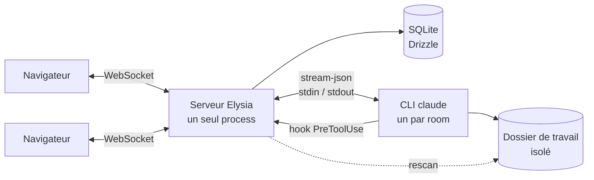

<div align="center">


# multiclaude

**Un agent Claude Code. Plusieurs personnes. Une seule conversation.**

Chat collaboratif en temps réel au-dessus du CLI Claude Code — réponses en flux, actions
visibles, fichiers en direct, et une décision humaine avant toute commande dangereuse.

[](LICENSE)
[](https://bun.sh)
[](https://www.typescriptlang.org)
[](https://www.benode.fr)

[English](README.md) ·
**Français** ·
[Español](README_es.md) ·
[Deutsch](README_de.md) ·
[简体中文](README_zh.md)


</div>

---

## Pourquoi

Claude Code est excellent, et résolument mono-joueur. Travaillez à deux sur une vraie
tâche et vous finissez par lire un terminal par-dessus l'épaule de l'autre, à lui demander
de lancer les choses à votre place, et à perdre chaque décision au moment où la fenêtre se
ferme.

multiclaude met cet agent dans une pièce. Tout le monde écrit dans la même conversation,
voit les mêmes actions, ouvre les mêmes fichiers, et peut arrêter ou réorienter l'agent.
Le travail est persistant, le contexte est partagé, et personne n'a besoin d'être celui
qui tient le clavier.

Il pilote le **vrai binaire `claude`** sur votre machine, avec votre propre abonnement.
Pas de clé API, pas de proxy, aucune réimplémentation de la boucle d'agent.

---

## Fonctionnalités

### Travailler ensemble

|  |  |
| --- | --- |
| **Présence en direct** | Qui est connecté, où chacun se trouve dans le fil, et quel fichier il a ouvert. |
| **Suivre quelqu'un** | Cliquez sur l'avatar d'un participant et votre vue devient le miroir de la sienne — même fichier, même position de défilement. |
| **Sélections partagées** | Le texte que quelqu'un sélectionne apparaît surligné à sa couleur, dans le fil comme dans les documents, à la manière d'un document partagé. |
| **Frappe, et coup d'œil** | Un indicateur montre qui écrit ; survolez-le pour lire son brouillon avant l'envoi. |
| **Brouillons partagés** | Votre message non envoyé vous suit d'un appareil à l'autre et survit à un redémarrage. |
| **File d'attente** | L'agent traite un tour à la fois. Les messages concurrents s'empilent, épinglés au-dessus de la saisie — modifiables et annulables tant qu'ils ne sont pas partis. |
| **Interruption** | Stoppez un tour en cours sans tuer le process ni perdre la session. |
| **Forker une conversation** | Mêmes fichiers, même contexte hérité, deux fils qui divergent. Explorez sans abîmer le travail de l'autre. |
| **Archiver plutôt que supprimer** | Retirer une conversation l'archive : historique, fichiers et contexte restent, et un clic la ramène. L'effacement définitif est une action séparée et délibérée. |

### L'agent

|  |  |
| --- | --- |
| **Votre abonnement** | Un process `claude` durable par conversation, piloté en `stream-json`. Pas de clé API. |
| **Dossier de travail isolé** | Chaque conversation a le sien. L'agent ne voit jamais les autres. |
| **Des sessions qui survivent** | Le process meurt, la session non : le tour suivant la reprend. |
| **Changement de modèle** | Changez de modèle en cours de conversation ; tout le monde voit le basculement. |
| **Jauge de contexte** | Consommation de jetons en direct face à la fenêtre, et une note dans le fil quand une compaction survient. |
| **Connexion depuis l'interface** | La connexion OAuth s'exécute sans terminal : ouvrez le lien, collez le code en retour. |

### Garder le contrôle

|  |  |
| --- | --- |
| **Politique par commande** | `grep`, `python`, `curl`, `npm`, `git commit` passent seuls. `sudo`, `pg_dump`, `git push`, `docker`, les suppressions hors du dossier de travail et les accès aux secrets s'arrêtent et demandent. |
| **Testée** | La politique porte sa propre suite de tests. Elle ne bouge pas sans filet. |
| **N'importe qui décide** | La demande apparaît dans le fil sous forme de carte, avec son motif. Tout participant peut autoriser ou refuser. |
| **Jamais manquée** | Un carillon, un titre d'onglet qui clignote, et une notification système quand l'onglet est fermé. |
| **Réglable** | `ALWAYS_ASK_TOOLS=Bash` fait confirmer chaque commande ; `ASK_PATTERNS` ajoute vos propres signaux d'alerte. |

### Fichiers et dépôts

|  |  |
| --- | --- |
| **Dossier de travail en direct** | Les fichiers écrits par l'agent apparaissent dans le fil et dans un panneau latéral, en arborescence ou en liste chronologique. |
| **Rendus, pas téléchargés** | Markdown, code avec coloration syntaxique, et aperçus HTML — dans un cadre isolé qui ne peut pas atteindre l'application. |
| **Suit le travail** | Un document modifié pendant que vous le lisez se rafraîchit sur place, sans perdre votre position. |
| **Déposez n'importe quoi** | Collez ou glissez des fichiers n'importe où dans la fenêtre ; ils atterrissent dans le dossier de travail de la conversation. |
| **Partir d'un dépôt** | Clone à la création, branche comprise. Dépôts privés par jeton d'accès — utilisé une fois, puis oublié — ou par clé SSH détenue par le serveur. |
| **Export** | N'importe quelle conversation en markdown, en un clic. |

### Faire tourner pour une équipe

|  |  |
| --- | --- |
| **Comptes locaux** | E-mail et mot de passe, sessions en SQLite, aucun service externe. Le premier compte est administrateur. |
| **Panneau d'administration** | Créez des membres, distribuez des mots de passe temporaires, changez les rôles, et lisez la configuration effective du serveur. |
| **Changement de mot de passe imposé** | Un compte créé par un administrateur ne va nulle part tant que le mot de passe temporaire n'est pas remplacé. |
| **CLI de comptes** | Les mêmes opérations depuis un shell, pour le jour où plus personne ne peut se connecter. |
| **Recherche** | Dans toutes les conversations, depuis la barre latérale. |
| **Thèmes** | Clair, sombre, ou suivre le système. |
| **Mobile** | Vraie mise en page responsive, installable comme une application, utilisable sur téléphone. |
| **Un seul port** | Le serveur sert aussi l'interface : pas de CORS, WebSocket en même origine, un seul process à superviser. |

---

## Démarrage rapide

```bash
git clone https://github.com/benode-SAS/multiclaude.git
cd multiclaude
cp .env.example .env
bun install
bun run db:migrate
bun run dev
```

L'interface écoute sur `http://localhost:3000`, l'API sur `8000`.

**Prérequis :** [Bun](https://bun.sh) 1.3+, le CLI [Claude Code](https://claude.com/claude-code)
accessible dans votre `PATH`, et `git`.

Deux choses se passent au premier lancement : l'application demande de créer le **compte
administrateur** — c'est simplement le premier compte créé — et la clé dans la barre
latérale connecte votre abonnement Claude via un lien à ouvrir et un code à coller en
retour.

---

## Déployer

<details>
<summary><strong>Docker</strong> — le chemin le plus court</summary>

```bash
docker build -t multiclaude .
docker run -p 8000:8000 -v multiclaude-data:/data \
  -e PUBLIC_URL=https://multiclaude.example.com \
  -e ADMIN_EMAIL=admin@example.com -e ADMIN_PASSWORD='un-mot-de-passe-solide' \
  multiclaude
```

Tout l'état — base SQLite, dossiers de travail, identifiants Claude — tient dans `/data`.
C'est le seul volume à sauvegarder.

Sur Railway, Fly ou équivalent : pointez le service sur ce `Dockerfile`, attachez un volume
persistant sur `/data`, et renseignez `PUBLIC_URL`. Sans volume, chaque redéploiement repart
de zéro.

</details>

<details>
<summary><strong>Sur un serveur</strong>, avec ou sans PM2</summary>

```bash
cp .env.example .env    # renseignez au moins PORT, DATA_DIR et PUBLIC_URL
bun run deploy          # install + build + migrations
bun run start
```

`ecosystem.config.cjs` fournit une configuration PM2 : un seul process (l'état des rooms
vit en mémoire, donc jamais de mode cluster), un garde-fou contre les boucles de
redémarrage, et un délai d'arrêt assez long pour que les process `claude` enfants se
terminent proprement.

```bash
pm2 start ecosystem.config.cjs && pm2 save
```

</details>

---

## Gérer les comptes

Le premier compte créé est administrateur. Ensuite, ⚙ → **Users** ajoute quelqu'un :
l'application génère un mot de passe temporaire, affiché une seule fois, que l'intéressé
doit remplacer à sa première connexion. La clé en regard d'un compte le régénère.

Cela fonctionne quel que soit le réglage des inscriptions — `SIGNUP_ENABLED` ne gouverne
que le formulaire public.

Les mêmes opérations existent en ligne de commande, ce qui est nécessaire le jour où plus
personne ne peut se connecter :

```bash
bun run cli users list
bun run cli users add alice@example.com "Alice Martin" --admin
bun run cli users password alice@example.com    # régénère le mot de passe
bun run cli users role alice@example.com member
bun run cli users remove alice@example.com
```

Le CLI applique les mêmes garde-fous que l'interface : il refuse de retirer le dernier
administrateur, et il applique les migrations en attente si la base est en retard.

---

## Configuration

Tout se règle dans un `.env` à la racine ; `.env.example` documente chaque variable. Les
plus structurantes :

| Variable | Rôle |
| --- | --- |
| `PORT` | Port de l'API et de l'interface |
| `PUBLIC_URL` | URL publique — les cookies de session en dépendent |
| `DATA_DIR` | Base, dossiers de travail, identifiants. Le seul dossier à sauvegarder |
| `SIGNUP_ENABLED` | Le formulaire public d'inscription. Un administrateur crée des comptes dans tous les cas |
| `ADMIN_EMAIL` / `ADMIN_PASSWORD` | Crée l'administrateur au démarrage, sans intervention |
| `CLAUDE_CONFIG_DIR` | Où le CLI range ses identifiants. Le pointer dans `DATA_DIR` rend le déploiement autonome |
| `ALWAYS_ASK_TOOLS` | Outils qui demandent toujours confirmation. `Bash` verrouille tout |
| `ASK_PATTERNS` | Motifs supplémentaires forçant une confirmation, ex. `prod,deploy\.sh` |
| `CLONE_DEPTH` | Profondeur du clone à la création d'une room. `0` pour l'historique complet |
| `GIT_TOKEN` / `GIT_SSH_KEY` | Accès par défaut aux dépôts privés, quand personne ne saisit de jeton |

---

## Sécurité — à lire avant d'exposer une instance

**L'agent exécute du code sur la machine hôte.** C'est l'intérêt de l'outil, et son risque.
Trois points comptent :

1. **Ne le faites pas tourner en `root`.** Créez un utilisateur dédié. La politique de
   permissions demande confirmation avant les commandes dangereuses, mais elle fonctionne
   par liste de refus : une commande destructrice non prévue passera. Pour verrouiller,
   `ALWAYS_ASK_TOOLS=Bash` fait confirmer chaque commande.

2. **Tout compte peut lancer des commandes.** Il n'y a pas de bac à sable entre les
   membres : donnez des comptes à des gens de confiance, et fermez les inscriptions
   (`SIGNUP_ENABLED=false`) sur une instance joignable depuis Internet.

3. **L'aperçu HTML exécute du JavaScript**, dans une origine opaque (`sandbox` sans
   `allow-same-origin`) : la page ne peut atteindre ni l'application, ni le stockage, ni
   l'API. Elle peut en revanche émettre des requêtes sortantes.

Les secrets restent hors de portée de l'agent : `AUTH_SECRET`, `ADMIN_PASSWORD` et
`GIT_TOKEN` sont retirés de l'environnement transmis au CLI, et un jeton de clone
n'atterrit jamais dans `.git/config`.

Une faille trouvée ? [SECURITY.md](SECURITY.md).

---

## Comment ça marche



Monorepo Bun : `apps/server` (Elysia + WebSocket), `apps/web` (React + Vite),
`packages/shared` (contrat WebSocket et types partagés).

**Une room, un process `claude`**, gardé vivant entre les tours pour que la conversation
conserve son contexte. S'il meurt, il revient avec `--resume` sur la même session. Le fork
dérive la session parente.

**Les permissions passent par un hook `PreToolUse`** qui appelle le serveur et bloque
jusqu'au clic d'un humain. C'est ce qui permet de trancher depuis l'interface plutôt que
depuis un terminal.

**Les changements de fichiers viennent d'un rescan du dossier**, pas des seuls événements
système : l'agent écrit via un fichier temporaire puis renomme, et le nom final
n'apparaît jamais dans l'événement.

**L'état des rooms vit en mémoire** — d'où un seul process serveur, jamais de mode cluster.

```bash
bun run dev        # serveur + interface en watch
bun run check      # lint et formatage (Biome)
bun run typecheck
bun run test
```

---

## Contribuer

Les issues et les pull requests sont bienvenues. Avant de proposer un changement :
`bun run check`, `bun run typecheck` et `bun run test` doivent passer — c'est ce que lance
la CI. Voir [CONTRIBUTING.md](CONTRIBUTING.md) pour les conventions.

Le dépôt est en anglais : code, commentaires, messages de commit, documentation et chaînes
de l'interface. Ces traductions du README suivent [la version anglaise](README.md), qui
fait foi en cas d'écart.

## Origine et licence

multiclaude est développé et maintenu par **[benode](https://www.benode.fr)**, et publié
sous licence **MIT** — voir [LICENSE](LICENSE).

La MIT autorise tout : usage privé ou commercial, modification, redistribution,
intégration dans un produit fermé, revente. Elle pose **une seule condition** : conserver
la mention de copyright et le texte de la licence dans les copies et les travaux dérivés.
Autrement dit, faites-en ce que vous voulez, mais ne retirez pas la paternité.
