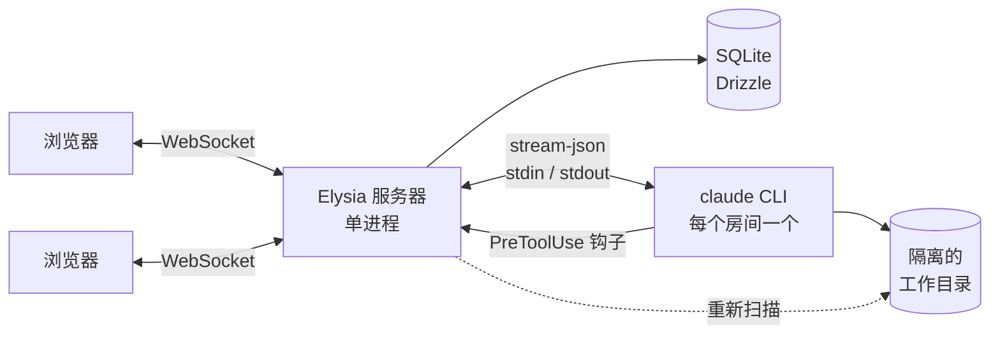

<div align="center">


# multiclaude

**一个 Claude Code 智能体。多个人。同一场对话。**

基于 Claude Code CLI 的实时协作聊天 —— 流式回复、可见的操作、实时更新的文件，以及在任何危险
命令执行之前的一次人工决定。

[](LICENSE)
[](https://bun.sh)
[](https://www.typescriptlang.org)
[](https://www.benode.fr)

[English](README.md) ·
[Français](README_fr.md) ·
[Español](README_es.md) ·
[Deutsch](README_de.md) ·
**简体中文**


</div>

---

## 为什么做这个

Claude Code 很出色，却固执地只服务一个人。两个人一起做一件真事，最后往往是一个人趴在另一个人
肩后看终端，请对方替自己执行命令，而每一个决定都在窗口关闭的那一刻消失。

multiclaude 把这个智能体放进一个房间。所有人在同一场对话里输入，看到同样的操作，打开同样的文
件，都可以叫停或改变智能体的方向。工作会保存下来，上下文是共享的，没有人必须当那个握键盘的人。

它驱动你机器上**真正的 `claude` 可执行文件**，用你自己的订阅。没有 API 密钥，没有代理，也没有
重新实现一遍智能体循环。

---

## 功能

### 一起工作

|  |  |
| --- | --- |
| **实时在场** | 谁在线、他在对话流中的位置、打开了哪个文件。 |
| **跟随某人** | 点击某位参与者的头像，你的视图便与他同步 —— 同一个文件，同一个滚动位置。 |
| **共享选区** | 有人选中的文字会以他的颜色高亮显示，对话流里和文档里都是，就像共享文档那样。 |
| **正在输入，可预览** | 指示器显示谁在写；把鼠标移上去就能在对方发送之前读到草稿。 |
| **共享草稿** | 尚未发送的消息会跟着你换设备，也能挺过一次重启。 |
| **消息队列** | 智能体一次只处理一轮。并发的消息排队等待，钉在输入框上方 —— 发出去之前都可以修改或取消。 |
| **中断** | 停止正在进行的一轮，既不杀掉进程，也不丢失会话。 |
| **派生对话** | 相同的文件、相同的继承上下文，两条从此分岔的线索。放手尝试，不会毁掉别人的工作。 |
| **归档而非删除** | 移除一场对话即归档：历史、文件和上下文都保留，一次点击即可找回。彻底抹除是另一个需要刻意执行的动作。 |

### 智能体

|  |  |
| --- | --- |
| **你的订阅** | 每场对话一个长期存活的 `claude` 进程，通过 `stream-json` 驱动。无需 API 密钥。 |
| **隔离的工作目录** | 每场对话都有自己的目录，智能体永远看不到别人的。 |
| **能存活的会话** | 进程死了，会话不会：下一轮会把它接回来。 |
| **切换模型** | 对话进行中即可换模型，所有人都会看到这次切换。 |
| **上下文计量** | 实时显示 token 用量与窗口的对比，发生压缩时在对话流里留下一条提示。 |
| **在界面里登录** | OAuth 登录无需终端：打开链接，把返回的代码粘贴回来。 |

### 保持掌控

|  |  |
| --- | --- |
| **按命令制定策略** | `grep`、`python`、`curl`、`npm`、`git commit` 无人值守地执行。`sudo`、`pg_dump`、`git push`、`docker`、工作目录之外的删除以及对密钥的读取会停下来询问。 |
| **有测试保障** | 这套策略自带测试用例，改动它不会没有安全网。 |
| **谁都可以决定** | 请求会作为一张卡片出现在对话流中，并附上原因。任何参与者都能允许或拒绝。 |
| **不会被漏掉** | 提示音、闪烁的标签页标题，以及标签页关闭时的系统通知。 |
| **可调** | `ALWAYS_ASK_TOOLS=Bash` 让每条命令都询问；`ASK_PATTERNS` 可加入你自己的警戒词。 |

### 文件与仓库

|  |  |
| --- | --- |
| **实时工作目录** | 智能体写下的文件会出现在对话流和侧边面板里，可按目录树或按时间顺序列表查看。 |
| **直接渲染，无需下载** | Markdown、带语法高亮的代码，以及 HTML 预览 —— 都在一个够不到应用本身的沙箱框架里。 |
| **跟随工作** | 你正在阅读的文档若被改动，会就地刷新，不会丢失你的位置。 |
| **随手拖放** | 在窗口任意位置粘贴或拖入文件，它们会落进这场对话的工作目录。 |
| **从仓库开始** | 创建时克隆，可指定分支。私有仓库可用访问令牌 —— 用过一次即遗忘 —— 或用服务器持有的 SSH 密钥。 |
| **导出** | 任意对话一键导出为 markdown。 |

### 团队部署

|  |  |
| --- | --- |
| **本地账号** | 邮箱加密码，会话存在 SQLite 里，不依赖外部服务。第一个账号即管理员。 |
| **管理面板** | 创建成员、发放临时密码、修改角色，并查看服务器的实际配置。 |
| **强制修改密码** | 管理员创建的账号在替换临时密码之前寸步难行。 |
| **账号 CLI** | 同样的操作也能在 shell 里完成，专为没人能登录的那一天准备。 |
| **搜索** | 在侧边栏中跨全部对话搜索。 |
| **主题** | 浅色、深色，或跟随系统。 |
| **移动端** | 真正的响应式布局，可作为应用安装，手机上也能用。 |
| **单一端口** | 服务器同时提供界面：没有 CORS，WebSocket 同源，只有一个进程需要照看。 |

---

## 快速开始

```bash
git clone https://github.com/benode-SAS/multiclaude.git
cd multiclaude
cp .env.example .env
bun install
bun run db:migrate
bun run dev
```

界面监听 `http://localhost:3000`，API 监听 `8000`。

**依赖：**[Bun](https://bun.sh) 1.3+、位于 `PATH` 中的
[Claude Code](https://claude.com/claude-code) CLI，以及 `git`。

首次启动会发生两件事：应用请你创建**管理员账号** —— 也就是第一个被创建的账号 —— 而侧边栏中的
钥匙按钮会通过一个你打开的链接和一段粘贴回来的代码，接上你的 Claude 订阅。

---

## 部署

<details>
<summary><strong>Docker</strong> —— 最短的路</summary>

```bash
docker build -t multiclaude .
docker run -p 8000:8000 -v multiclaude-data:/data \
  -e PUBLIC_URL=https://multiclaude.example.com \
  -e ADMIN_EMAIL=admin@example.com -e ADMIN_PASSWORD='a-solid-password' \
  multiclaude
```

全部状态 —— SQLite 数据库、工作目录、Claude 凭据 —— 都在 `/data` 里。这是唯一值得备份的卷。

在 Railway、Fly 或类似平台上：让服务指向这个 `Dockerfile`，在 `/data` 挂载持久卷，并设置
`PUBLIC_URL`。没有卷，每次重新部署都会从零开始。

</details>

<details>
<summary><strong>在服务器上</strong>，用或不用 PM2</summary>

```bash
cp .env.example .env    # 至少设置 PORT、DATA_DIR 和 PUBLIC_URL
bun run deploy          # 安装 + 构建 + 迁移
bun run start
```

`ecosystem.config.cjs` 提供了一份 PM2 配置：单进程（房间状态存在内存里，因此绝不使用集群模
式）、防止重启循环的保护，以及足够长的关闭超时，好让子 `claude` 进程收尾。

```bash
pm2 start ecosystem.config.cjs && pm2 save
```

</details>

---

## 管理账号

第一个被创建的账号是管理员。之后通过 ⚙ → **Users** 添加成员：应用会生成一个只显示一次的临时
密码，对方必须在首次登录时替换它。账号旁边的钥匙按钮可以重新生成。

无论注册开关如何设置，这条路都有效 —— `SIGNUP_ENABLED` 只管公开的注册表单。

同样的操作也存在于命令行，正是没人能再登录时你需要的东西：

```bash
bun run cli users list
bun run cli users add alice@example.com "Alice Martin" --admin
bun run cli users password alice@example.com    # 重新生成密码
bun run cli users role alice@example.com member
bun run cli users remove alice@example.com
```

CLI 执行与界面相同的防护：它拒绝移除最后一位管理员，并在数据库落后时运行待执行的迁移。

---

## 配置

一切都在根目录的 `.env` 中设置；`.env.example` 记录了每一个变量。影响部署形态的那些：

| 变量 | 作用 |
| --- | --- |
| `PORT` | API 与界面的端口 |
| `PUBLIC_URL` | 公开 URL —— 会话 cookie 依赖它 |
| `DATA_DIR` | 数据库、工作目录、凭据。唯一需要备份的目录 |
| `SIGNUP_ENABLED` | 公开的注册表单。无论如何管理员都能创建账号 |
| `ADMIN_EMAIL` / `ADMIN_PASSWORD` | 启动时无人值守地创建管理员 |
| `CLAUDE_CONFIG_DIR` | CLI 存放凭据的位置。指向 `DATA_DIR` 内可让部署自成一体 |
| `ALWAYS_ASK_TOOLS` | 始终需要确认的工具。填 `Bash` 即全面锁死 |
| `ASK_PATTERNS` | 额外触发确认的匹配模式，例如 `prod,deploy\.sh` |
| `CLONE_DEPTH` | 创建房间时的克隆深度。`0` 表示完整历史 |
| `GIT_TOKEN` / `GIT_SSH_KEY` | 无人输入令牌时，访问私有仓库的默认凭据 |

---

## 安全 —— 对外开放实例之前请读

**智能体会在宿主机上执行代码。** 这是这个工具的意义，也是它的风险。三点最重要：

1. **不要以 `root` 运行。** 建一个专用用户。权限策略会在危险命令前询问，但它是一份拒绝清单：
   没有被预料到的破坏性命令仍会通过。要彻底锁死，用 `ALWAYS_ASK_TOOLS=Bash` 让每条命令都询问。

2. **任何账号都能执行命令。** 成员之间没有沙箱：把账号交给你信任的人，并在可从互联网访问的实例
   上关闭注册（`SIGNUP_ENABLED=false`）。

3. **HTML 预览会执行 JavaScript**，运行在不透明源中（`sandbox` 且不带 `allow-same-origin`）：
   页面既够不到应用，也够不到存储和 API。但它仍然可以发出对外请求。

密钥不在智能体的可及范围内：`AUTH_SECRET`、`ADMIN_PASSWORD` 和 `GIT_TOKEN` 会从交给 CLI 的环
境变量中剔除，克隆用的令牌也绝不会写进 `.git/config`。

发现漏洞？见 [SECURITY.md](SECURITY.md)。

---

## 工作原理



Bun monorepo：`apps/server`（Elysia + WebSocket）、`apps/web`（React + Vite）、
`packages/shared`（WebSocket 约定与共享类型）。

**一个房间，一个 `claude` 进程**，在两轮之间保持存活，好让对话留住上下文。进程若死，它会带着
`--resume` 回到同一个会话。派生则从父会话分叉。

**权限经由 `PreToolUse` 钩子**，它回调服务器并一直阻塞，直到有人点击。正是这一点，让决定发生在
界面里而不是终端里。

**文件变化来自对目录的重新扫描**，而不仅仅是系统事件：智能体先写临时文件再改名，最终的文件名从
不出现在事件里。

**房间状态存在内存中** —— 因此只有一个服务器进程，绝不使用集群模式。

```bash
bun run dev        # 服务器 + 界面，监听模式
bun run check      # 检查与格式化（Biome）
bun run typecheck
bun run test
```

---

## 参与贡献

欢迎提交 issue 和 pull request。提出改动之前，`bun run check`、`bun run typecheck` 和
`bun run test` 必须通过 —— CI 跑的正是这三条。约定见
[CONTRIBUTING.md](CONTRIBUTING.md)。

本仓库使用英文：代码、注释、提交信息、文档和界面文案。这些 README 译本以
[英文版](README.md)为准，出现分歧时以英文版为准。

## 来源与许可证

multiclaude 由 **[benode](https://www.benode.fr)** 开发和维护，以 **MIT** 许可证发布 ——
见 [LICENSE](LICENSE)。

MIT 允许一切：私人或商业使用、修改、再分发、并入闭源产品、转售。它只提出**一个条件**：在副本和
衍生作品中保留版权声明和许可证文本。换句话说，随你怎么用，但不要抹去署名。
